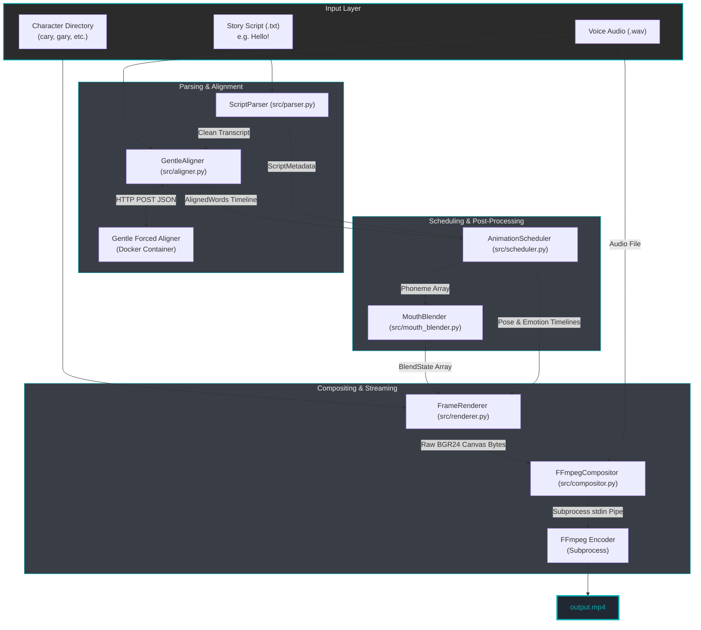

# ToonToon: High-Performance Unified Animation Pipeline

Welcome to the ToonToon documentation. This system is a professional-grade refactoring of Carykh's legacy `lazykh` animation pipeline, consolidated into a **single, production-ready Python engine**. By streaming composited frames directly into an active FFmpeg pipe, ToonToon completely eliminates intermediate disk I/O, reducing execution time and physical storage wear.

---

## 🚀 Key Pipeline Advantages

ToonToon eliminates the historical performance bottlenecks of legacy stick-figure and mouth-shape compositing pipelines:

| Optimization Area | Legacy `lazykh` Pipeline | ToonToon Engine |
| :--- | :--- | :--- |
| **Disk Operations** | Writes 90,000+ PNG files to disk during rendering, then reads them back | **Zero Disk I/O.** Streams raw BGR24 matrix bytes directly to FFmpeg stdin |
| **Frame Duplication** | Uses `shutil.copyfile()` to copy duplicate frames on the filesystem | **In-Memory Signatures.** Caches rendered frames in RAM for instant reuse |
| **Coarticulation** | Abrupt, blocky shape changes between phonemes | **MouthBlender Post-Processor.** Eased cross-fading and vowel anticipation |
| **Audio Multiplexing** | Manual Python loops over matrices using `scipy.io` | **FFmpeg Filter Graphs.** Native, parallel volume scaling and track mixing |
| **Configuration** | Scattered hardcoded constants across 5+ independent scripts | **Unified Character Manifest.** Type-safe schemas and dynamic JSON loading |

---

## 🏗️ System Architecture & Data Flow

ToonToon operates as a single continuous pipeline in memory. The diagram below illustrates how raw text and audio inputs propagate through each subsystem to compile the final video:

---

## 📊 Core Mathematical Foundations

ToonToon implements several structural equations to calculate pose mappings, upscaled canvas region coordinate geometry, and transition scaling vectors.

### 1. Pose File Index Calculation

To address the asset files correctly, the renderer resolves a 3D state vector (Emotion ID, Pose ID, and Blink State) into a 1D file index:

$$\text{Pose Index} = (\text{Emotion ID} \times 5 + \text{Pose ID}) \times 3 + \text{Blink State} + 1$$

> [!NOTE]
> *   **Emotion ID**: 0 to 5 (explain, happy, sad, angry, confused, rq)
>   *   **Pose ID**: 0 to 4 (individual poses within each emotion)
>   *   **Blink State**: 0 (eyes open), 1 (eyes half-closed), 2 (eyes fully closed)
>
> This mapping resolves exactly to **90 pose files** (`pose0001.png` to `pose0090.png`), loaded dynamically.

### 2. Coordinate Upscaling

Legacy character coordinate templates were recorded in a **640×360** canvas box. Modern target layouts render at **1920×1080** (Full HD). To map mouth positions accurately onto upscaled body layers:

$$\text{Upscaled Coordinate} = \text{Legacy Coordinate} \times 3.0$$

> [!TIP]
> The renderer scales the coordinates automatically using the `coordinate_scale_factor` specified in the character's manifest.

### 3. Vectorized Alpha Blending

Transparent overlay compositions (mouth onto body, and body onto the background) are vectorized using NumPy broadcasting instead of standard Python pixel loops:

$$\text{Canvas}_{\text{rgb}} = \alpha \times \text{Overlay}_{\text{rgb}} + (1.0 - \alpha) \times \text{Canvas}_{\text{rgb}}$$

$$\alpha = \frac{\text{Overlay}_{\text{alpha}}}{255.0}$$

---

## 🏁 Quick Navigation

To help you explore the ToonToon Engine, choose a guide matching your goal:

*   📖 **[Architecture & Design Deep Dive](architecture.md)** — Core algorithms, scheduling tracks, and the `MouthBlender` coarticulation system.
*   🎨 **[Character Asset Onboarding](guides.md)** — Step-by-step instructions to add custom characters, generate manifests, and write coordinate files.
*   ⚙️ **[Configuration Reference](config.md)** — Comprehensive variables catalog, CLI argument listings, and logging guides.
*   📚 **[API Reference](reference.md)** — Auto-generated API details for each Python module.
